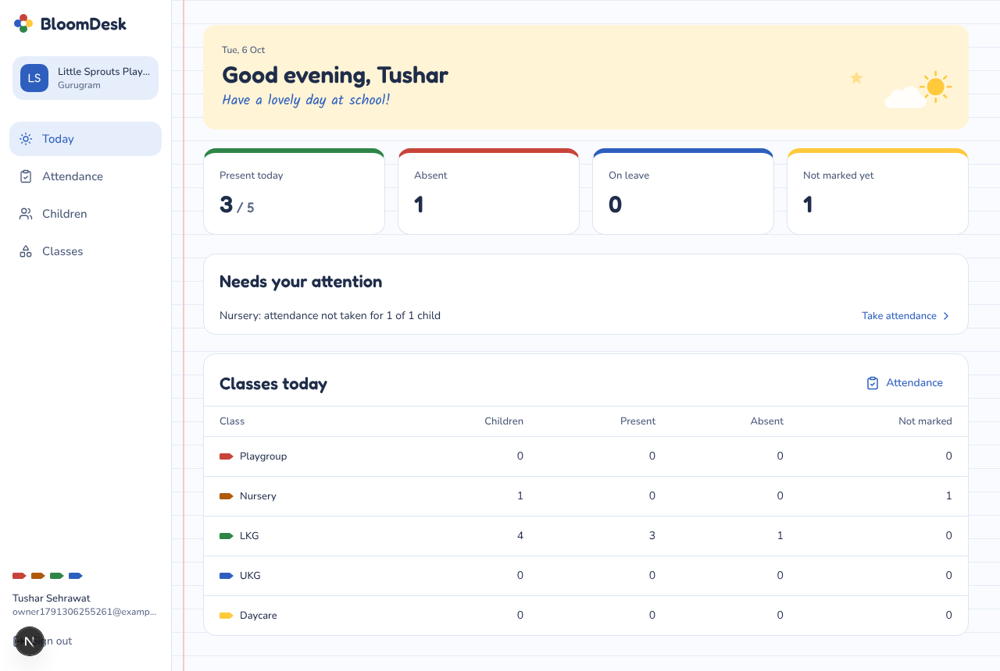
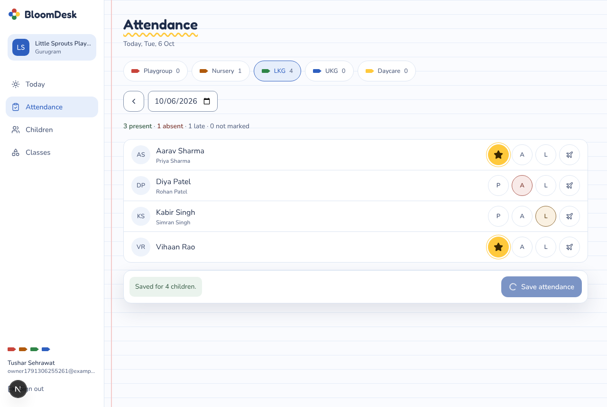
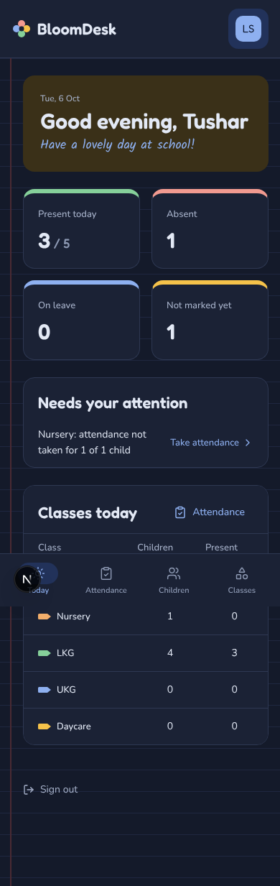

# BloomDesk

Simple software for play schools, preschools and daycares in India. One backend, three apps: **Owner** (web), **Teacher** and **Parent** (mobile). This repo starts with the Owner web app.

## Screenshots

| Today | Attendance | Phone, dark mode |
| --- | --- | --- |
|  |  |  |

## What works today

- **Set up a school**: sign up with email and password, name your school, and get Playgroup, Nursery, LKG and UKG classes added for you.
- **Today**: greeting, who is present / absent / on leave / not marked, classes that still need attendance, and a per-class summary.
- **Children**: add, edit, search and filter by class; parent name and +91 mobile; mark a child as left or re-admit them; last 30 days of attendance.
- **Classes**: add, rename, set level and seats, delete.
- **Attendance**: pick a class and day, mark Present / Absent / Late / On leave, "Mark everyone present", save.

Coming next (from the product plan): fees, admissions, parent communication, Excel import, Teacher and Parent apps.

## Stack

- Next.js 16 (App Router, Server Actions) + React 19 + TypeScript
- Tailwind CSS v4 with the **Crayon Box** theme (`src/styles/`, rules in `docs/design/DESIGN.md`)
- Supabase: Postgres with row level security per school, and Supabase Auth

## Run it locally

1. Create a free project at [supabase.com](https://supabase.com).
2. In the Supabase SQL editor, run `supabase/migrations/20261006000000_init.sql` (or `supabase db push` with the Supabase CLI).
3. In **Authentication → URL configuration**, set the Site URL to `http://localhost:3000` and add `http://localhost:3000/auth/callback` to the redirect URLs.
4. Copy `.env.example` to `.env.local` and fill in the project URL and publishable (anon) key from **Project settings → API**.
5. `npm install` then `npm run dev`, and open http://localhost:3000.

If email confirmation is on (the Supabase default), sign-up sends a link; open it in the same browser to finish. Turn it off under **Authentication → Sign in / Providers → Email** while developing to go straight in.

## How data is kept apart

Every table carries a `school_id`. Row level security only returns rows for schools the signed-in user belongs to (`school_members`). Owners and admins manage classes and children; teachers can read them and mark attendance. New schools are created only through the `create_school()` database function, which makes the caller the owner.

## Android app

`android/` is a small Android app that opens the BloomDesk web app full screen. It holds no screens of its own, so every web change shows up in the app straight away.

- **Get the APK**: every push that touches `android/` builds one on GitHub (Actions → Android APK → BloomDesk-debug-apk).
- **Point it at the web app**: set the `BLOOMDESK_URL` repository variable (e.g. `https://app.bloomdesk.in`) once the app is hosted. Until then the app asks for the address on first launch, so you can use `npm run dev -- -H 0.0.0.0` and type your laptop's address, like `http://192.168.1.10:3000`. Clear the app's data to change it.
- **Build it yourself**: open `android/` in Android Studio, or run `./gradlew assembleDebug -PbloomdeskUrl=https://…` in `android/`.

## Project layout

```
src/app/(auth)        sign in, sign up
src/app/onboarding    create the school after sign-up
src/app/(app)         the Owner app: today, attendance, children, classes
src/components/ui     buttons, fields, pills, class crayons, doodles
src/lib               Supabase clients, session, data access, formatting
src/styles            Crayon Box tokens (copied from the design hand-off)
supabase/migrations   database schema and security rules
docs/design           design system rules (DESIGN.md) and raw tokens
android               Android app that wraps the web app
```
